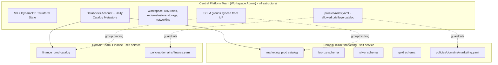
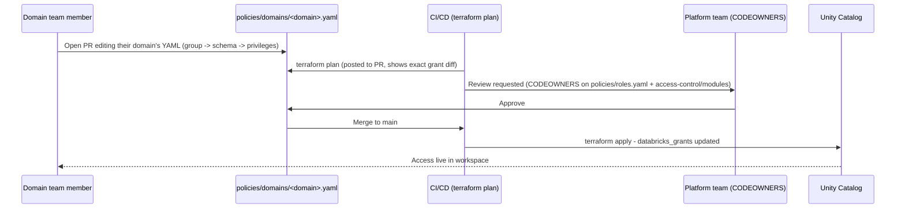
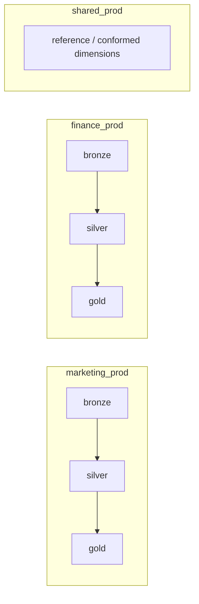

# Databricks on AWS — Decentralized Governance Platform

Owner: Central Platform Team (Workspace Admin)
Consumers: Domain teams (Data Engineers, Data Scientists, Data Analysts, Business Analysts)

## 1. Governance model

- **Platform team (you, workspace admin)** owns: Terraform state backend, AWS account infra, the
  Databricks workspace, the Unity Catalog metastore, SCIM/IdP group sync, and the *policy schema*
  (which privileges exist and which roles may use them).
- **Domain teams** own: their own catalog's schemas/tables, and their own RBAC assignments —
  expressed as a single YAML file per domain. They self-serve by opening a PR; they never touch
  `infrastructure/`.
- Everything is serverless: no clusters, no cluster policies, no instance pools. Compute surface is
  Serverless SQL Warehouses, Serverless Jobs compute, and Serverless notebook compute only.



## 2. Repo structure

```
databricks-platform/
├── infrastructure/                  # OWNED BY: platform team only
│   ├── backend/                     # one-time bootstrap: S3 + DynamoDB for TF state
│   ├── modules/
│   │   ├── workspace/               # databricks_mws_* - the AWS workspace itself
│   │   ├── unity-catalog-metastore/ # metastore, storage credential, IAM role
│   │   └── networking/              # (optional) PrivateLink / NCC for serverless
│   └── envs/
│       └── prod/                    # wires modules together, remote state backend
├── access-control/                  # OWNED BY: platform team (module) + domain teams (data)
│   ├── modules/
│   │   ├── domain-catalog/          # REUSABLE: 1 domain in -> catalog+schemas+grants out
│   │   └── groups/                  # optional group existence check / local fallback
│   └── main.tf                      # for_each over every file in policies/domains/*.yaml
├── policies/
│   ├── roles.yaml                   # canonical persona -> allowed privilege ceiling
│   └── domains/
│       ├── marketing.yaml           # <- domain team edits ONLY this file to self-serve
│       └── finance.yaml
└── README.md
```

Onboarding a **new domain** = adding one YAML file under `policies/domains/`. No new Terraform
resources need to be hand-written - `access-control/main.tf` discovers it via `fileset()`.

## 3. Access-request user flow


Each domain's own YAML file can be CODEOWNER'd to that domain's tech lead; only the shared module
and `roles.yaml` allow-list require platform-team review - this is what keeps it decentralized.

## 4. Catalog / schema layout (medallion per domain)



## 5. Access matrix

| Action / Resource                         | Workspace Admin | Data Engineer     | Data Scientist        | Data Analyst | Business Analyst |
|--------------------------------------------|:---:|:---:|:---:|:---:|:---:|
| Create / drop catalog                      | Y | N | N | N | N |
| CREATE_SCHEMA (bronze/silver)              | Y | Y own domain | N | N | N |
| CREATE_TABLE bronze / silver               | Y | Y | N | N | N |
| CREATE_TABLE / MODIFY gold                 | Y | Y | Y own ML/gold objects | N | N |
| SELECT bronze                              | Y | Y | Y | N | N |
| SELECT silver                              | Y | Y | Y | Y | N |
| SELECT gold                                | Y | Y | Y | Y | Y |
| CREATE_FUNCTION                            | Y | Y | Y | N | N |
| CREATE_VIEW                                | Y | Y | Y | Y (gold) | N |
| EXECUTE (functions / registered models)    | Y | Y | Y | Y | Y gold-scoped |
| Manage grants on own catalog               | Y | N (PR only) | N | N | N |
| Use Serverless SQL Warehouse               | Y | Y | Y | Y | Y |
| Create Serverless SQL Warehouse            | Y | Y | N | N | N |
| Create / own Serverless Jobs               | Y | Y | Y own jobs | N | N |
| Notebooks / Repos (Git folders)            | Y | Y | Y | limited (SQL editor) | limited (SQL editor / dashboards) |
| Manage secret scopes                       | Y | Y own domain | N | N | N |
| Workspace admin console                    | Y | N | N | N | N |
| Audit logs / billing                       | Y | N | N | N | N |
| Network / IP access lists                  | Y | N | N | N | N |

Privilege ceilings above are enforced in code - see `policies/roles.yaml` and the `check` blocks in
`access-control/modules/domain-catalog`.

## 6. Checklist

### AWS / account prerequisites (platform team, one-time)
- [ ] Dedicated AWS account (or OU) for the Databricks workspace(s)
- [ ] Databricks account created, account admin identified, account console access confirmed
- [ ] IdP (Okta/Azure AD/etc.) configured for SCIM provisioning of the 5 persona groups per domain
- [ ] `infrastructure/backend` applied **once**, locally, to create the S3 state bucket + DynamoDB
      lock table, before anything else uses the `s3` backend
- [ ] KMS key for state bucket + root/metastore bucket encryption
- [ ] Decide serverless networking posture: default (public) vs. Serverless Network Connectivity
      Config (NCC) + PrivateLink for AWS resources - provision `infrastructure/modules/networking`
      if PrivateLink is required
- [ ] Enable Serverless SQL Warehouses and Serverless compute for notebooks/jobs at the account level

### Infrastructure (platform team)
- [ ] `infrastructure/modules/workspace` applied -> workspace live, cross-account IAM role scoped
      to least privilege (no wildcard `s3:*`)
- [ ] `infrastructure/modules/unity-catalog-metastore` applied -> metastore created, assigned to
      workspace, storage credential validated (`databricks_metastore_data_access` default)
- [ ] Root and metastore S3 buckets: versioning on, public access blocked, `prevent_destroy` set
- [ ] Tagging standard applied to all AWS resources (`domain`, `environment`, `owner`, `cost-center`)
- [ ] Budget / cost anomaly alerting configured (serverless is consumption-billed)

### Access control (platform team ships the module, domain teams ship the data)
- [ ] `policies/roles.yaml` allow-list finalized and reviewed with security
- [ ] `access-control/modules/domain-catalog` reviewed and merged
- [ ] `access-control/main.tf` for_each wiring validated with a dry-run domain
- [ ] CODEOWNERS: `infrastructure/**`, `access-control/modules/**`, `policies/roles.yaml` ->
      platform team; `policies/domains/<name>.yaml` -> that domain's tech lead
- [ ] CI pipeline: `terraform plan` on PR (posts diff as comment), `terraform apply` on merge to
      main; plan output blocked from auto-apply if it touches `infrastructure/**`
- [ ] First domain (e.g. `marketing`) onboarded end-to-end as a template/example PR

### Groups & identity
- [ ] SCIM sync confirmed for all 5 persona groups per domain (or shared groups + catalog-scoped
      grants, per your naming convention)
- [ ] `workspace_admin` group mapped to Databricks account admins, not just workspace admin - Unity
      Catalog MANAGE/ALL_PRIVILEGES should sit with a break-glass admin group, not individuals

### Guardrails / compliance
- [ ] `check` blocks in `domain-catalog` module confirmed to fail plan on disallowed privileges
      (e.g., a domain file trying to grant ALL_PRIVILEGES)
- [ ] Unity Catalog audit logging enabled and shipped to a central log bucket
- [ ] Row/column-level security (if needed) documented as a follow-up - not covered by base grants
- [ ] Data classification / PII tagging strategy agreed with domain teams before gold-layer SELECT
      is opened to Business Analysts

### Rollout
- [ ] Runbook written for domain teams: "how to request a new catalog / new role grant" (points at
      section 3 above)
- [ ] Deprecation path for any pre-existing manually-created grants (import into Terraform or revoke)
- [ ] Quarterly access review scheduled (diff `databricks_grants` state vs. `policies/domains/*.yaml`)
